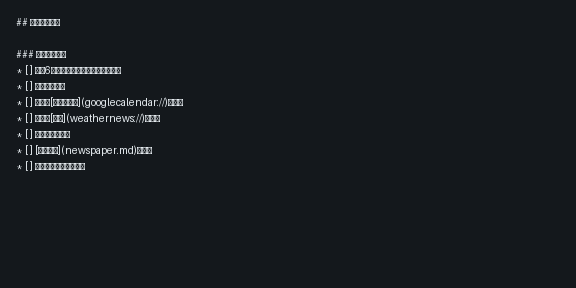
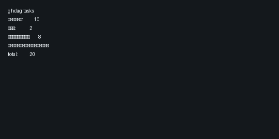
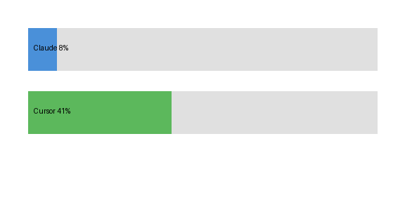

# nexus-companion

Even G2 向けのコンパニオンプラグインです。ローカル環境の情報を Even Realities グラス上から参照するための Even Hub アプリとして開発します。

本リポジトリは TypeScript + Vite で構成され、[`@evenrealities/even_hub_sdk`](https://www.npmjs.com/package/@evenrealities/even_hub_sdk) を用いて Even App との橋渡しを行います。

## 開発

```bash
npm install
npm run dev
npm run build
```

Node.js 20 系を使用してください（`.nvmrc` 参照）。

## スクリーンショット

evenhub-simulator 上での 3 ビュー確認結果（Issue #1625）:

| ビュー | 説明 |
|--------|------|
| Diary | `${NIKKI_ROOT}/日記/YYYY-MM-DD.md` の先頭ページ（10 行） |
| Dashboard | ghdag `/api/rows` から集計したタスク件数サマリ |
| Charge | Claude 週次 / Cursor 月次の 2 段バーグラフ（`OffscreenCanvas` 描画） |

### Diary ビュー



### Dashboard ビュー



### Charge ビュー



### シミュレータ起動手順

```bash
# nexus 側（charge_server + ghdag_ui）
overmind start -l charge_server,ghdag_ui

# nexus-companion 側
npm install && npm run build
npm run preview -- --host 127.0.0.1 --port 4173

# 別ターミナル
npx @evenrealities/evenhub-simulator http://127.0.0.1:4173 --automation-port 9898
```

Charge ビューは `OffscreenCanvas` + `updateImageRawData` で描画する。シミュレータ v0.7.x では Canvas API が利用可能であり、単体テスト（`tests/views/charge.test.ts`）でも描画を検証済み。
